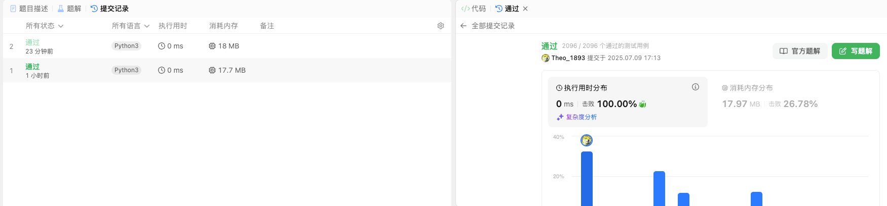
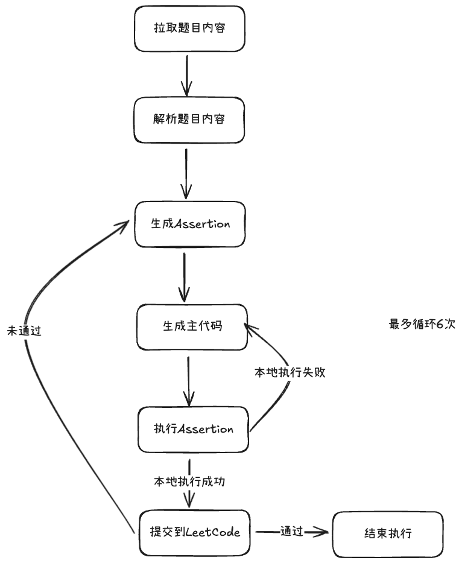

# 🤖 Leetcode Automata

> 🎯 **自动化LeetCode刷题的AI助手**
> 
> 本项目灵感来源 [lang-or-llama](https://github.com/unclefomotw/lang-or-llama), graphql来源 [alfa-leetcode-api](https://github.com/alfaarghya/alfa-leetcode-api).


## 🤔 这是什么

**本项目可以实现LeetCode做题流程的自动化** ✨

通过AI Agent自动完成:
- 📖 **读取题目** - 理解题目要求
- 💡 **生成解法** - 智能编写代码
- 🧪 **测试验证** - 自动运行测试用例
- 🚀 **提交答案** - 直接提交到LeetCode




## ⚙️ 如何运作

本项目主要由以下3个步骤构成:

### 📥 Step 1: 拉取题目
   - Agent 拉取指定LeetCode题目
   - 解析题目描述和要求
   - 提取示例测试用例

### 💻 Step 2: 编码
   - 🔍 **解析题目**: 理解题目要求和约束
   - 🧪 **生成测试用例**: 基于示例创建完整测试
   - 💡 **生成主代码**: AI编写解决方案
   - ✅ **本地测试**: 验证代码正确性

### 🚀 Step 3: 提交代码
   - 将完整的执行代码提交到LeetCode
   - 确认最终执行结果
   - 处理提交反馈


## 📊 详细流程

参考流程图:




## 🔧 准备工作

1. 🍪 **LeetCode Cookie**: 将用户的LeetCode cookie数据填写到 `leetcode_cookie.txt` 文件中
2. 🔑 **OpenAI API Key**: 将 `.env` 文件中的 `OPENAI_API_KEY` 填写为有效的api key
3. 📦 **安装依赖**: 

```bash
pip install -r requirements.txt
```


## 🎯 使用方法

### 📅 处理每日一题
```bash
python main.py --daily
```

### 🎯 处理指定题目
```bash
python main.py --title_slug=median-of-two-sorted-arrays
```


## 📋 待办项

- [ ] 🔧 优化反思机制: 
  - 当前 **用例执行** 和 **编码反思** 流程粒度较粗, 反思效果非常有限
  - 需要将流程细化到单个用例维度后, 观测是否有助于提高反思效果 

---

<div align="center">
  <sub>Built with ❤️ Using LangChain & OpenAI</sub>
</div>
